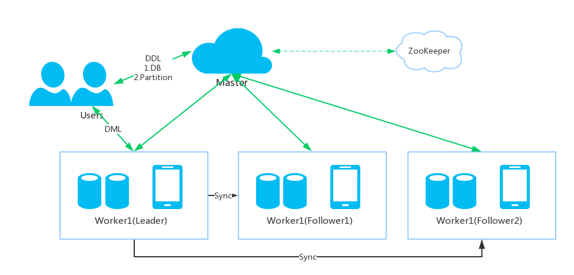

# RockRedis  

RockRedis is an open-source, distributed, versioned, fast NoSQL database.

##DB
RockRedis is a high performace key-value NoSQL database, an alternative to Redis.
It support: 
- kv get set
- k list(v) get add
- k sum(v) get add
- k max(v) get add
- message deliver queue
- TTL support
We use RocksDb to store data. 
Why RocksDb? TBD

##Distributed
We build distributed system like Kafka.
###Architecture

###Consistency
- Strong consistency: sync every time
- Eventually consistency: support snapshot(checkpoint)
###Grpc
use grpc in inter-process communication for auth/stream/across languages/protobuf

##RoadMap
TBD

